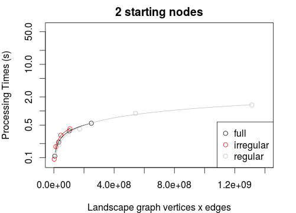
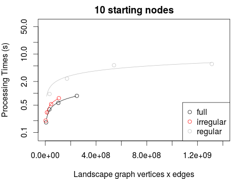
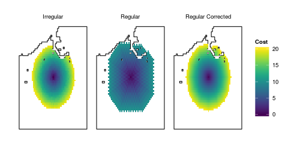

irlgraph
======

The `R` package `irlgraph` provides the functionality to generate accumulated cost surfaces using irregular landscape graphs.

##Installation
  ```R
  install.packages('devtools')  # package devtools needed
  devtools::install_github('jsta/irlgraph')
  ```
##Summary






##Examples
**see vignette**

##References
**Thomas Etherington (2012)**. Least-cost modelling on irregular landscape graphs.
*Landscape Ecology*
[journal](http://dx.doi.org/10.1007/s10980-012-9747-y)
